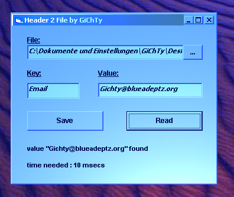



## Header2File\_by\_GiChTy

### Description

This one saves/reads some small headers in biary format to a file, e.g. to save some extra-data to an executable (such as almost any server-builder works!)
 
### More Info
 

             |
---                |---
**Submitted On**   |2002-05-01 18:20:30
**By**             |[gichty](https://github.com/Planet-Source-Code/PSCIndex/blob/master/ByAuthor/gichty.md)
**Level**          |Intermediate
**User Rating**    |4.3 (13 globes from 3 users)
**Compatibility**  |VB 5\.0, VB 6\.0
**Category**       |[Files/ File Controls/ Input/ Output](https://github.com/Planet-Source-Code/PSCIndex/blob/master/ByCategory/files-file-controls-input-output__1-3.md)
**World**          |[Visual Basic](https://github.com/Planet-Source-Code/PSCIndex/blob/master/ByWorld/visual-basic.md)
**Archive File**   |[Header2Fil78133512002\.zip](https://github.com/Planet-Source-Code/gichty-header2file-by-gichty__1-34290/archive/master.zip)

